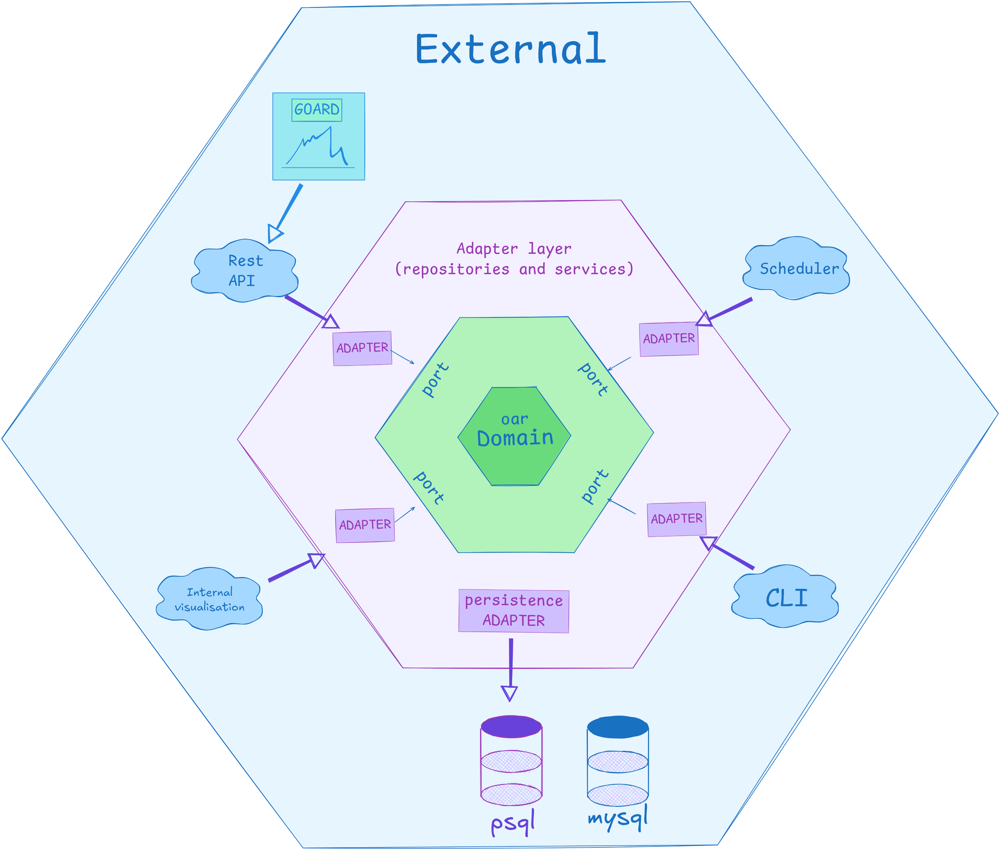
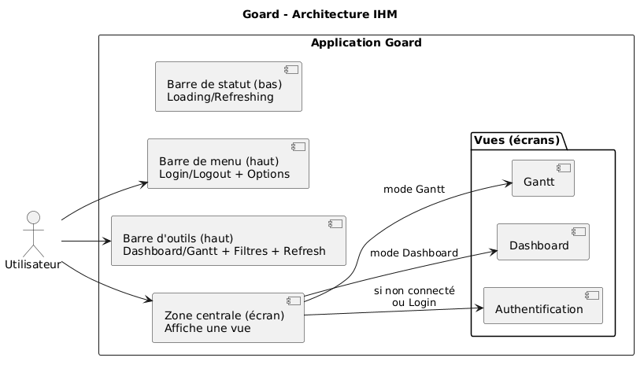
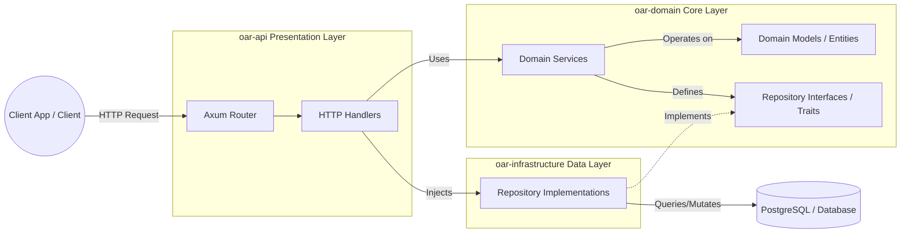
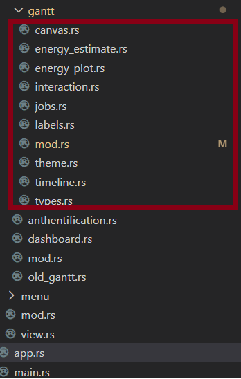
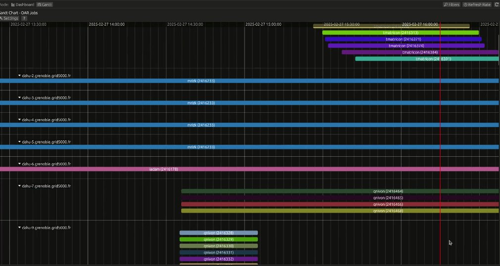
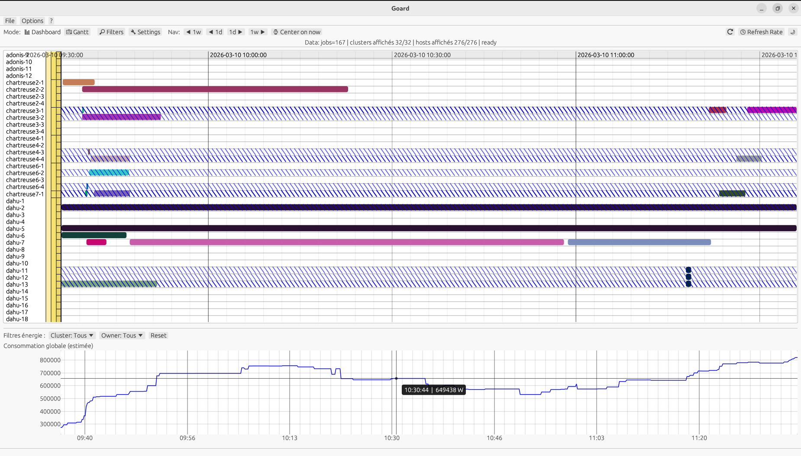
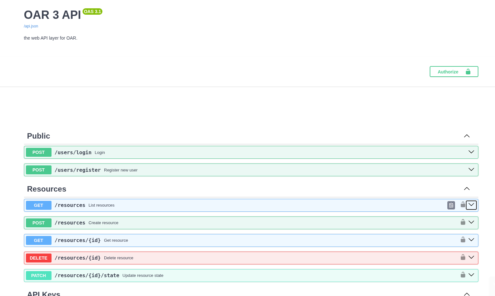
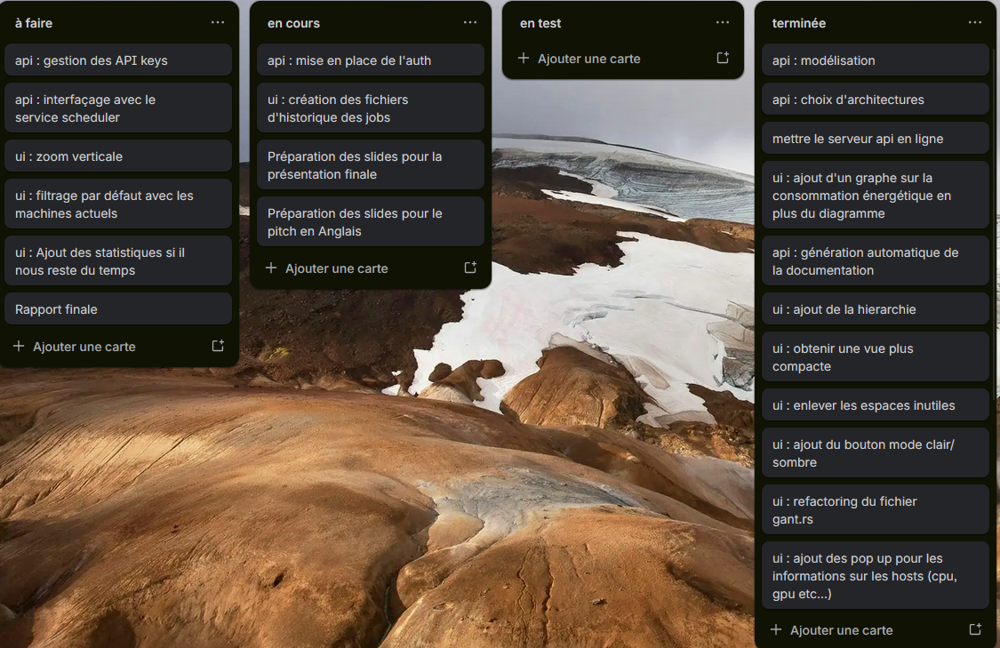

# Rapport OAR Redux

**Dépôt :** [OAR-26](https://github.com/OAR-26)  
**Plateforme :** Grid5000 (HPC)  
**Langage :** Rust — `egui / eframe / Axum`  
**Année :** 2025 — 2026  
**Tuteur :** Olivier RICHARD

| Dila MEMIL        | Moataz ER-RAMI    | Aymane AMESSEGHER | Mohammed-Amine SALMANE |
| ----------------- | ----------------- | ----------------- | ---------------------- |
| _Développeur IHM_ | _Développeur IHM_ | _Développeur IHM_ | _Développeur API_      |

_Polytech Grenoble — INFO5 — Mars 2026_

---

## Abstract

This report presents the results of the OAR Redux project, carried out within the framework of OAR and the Grid5000 platform. The objective of the project is to improve the visualization of jobs and resources in order to make the tools more readable and easier to use. To achieve this, we worked on redesigning certain parts of the software, improving the user interface, and evolving the API. The project was carried out as a team, with a clear distribution of tasks and regular exchanges with the client to validate the different stages. The developed solutions also aim to improve code maintainability and provide a clearer foundation for future developments.

## Résumé

Ce rapport présente les résultats du projet OAR Redux, réalisé dans le cadre d'OAR et de la plateforme Grid5000. L'objectif du projet est d'améliorer la visualisation des jobs et des ressources afin de rendre les outils plus lisibles et plus faciles à utiliser. Pour cela, nous avons travaillé sur la refonte de certaines parties du logiciel, l'amélioration de l'interface utilisateur et l'évolution de l'API. Le projet a été mené en équipe avec une répartition des tâches et des échanges réguliers avec le client afin de valider les différentes étapes. Les solutions développées visent également à améliorer la maintenabilité du code et à proposer une base plus claire pour les futures évolutions.

---

## Table des matières

1. [Positionnement de la compétence INFO](#1-positionnement-de-la-compétence-info)
2. [Rappel du sujet, besoin et cahier des charges](#2-rappel-du-sujet-besoin-et-cahier-des-charges)
3. [Technologies employées](#3-technologies-employées)
4. [Architecture technique](#4-architecture-technique)
5. [Réalisations techniques](#5-réalisations-techniques)
6. [Gestion de projet](#6-gestion-de-projet)
7. [Outils de collaboration](#7-outils-de-collaboration)
8. [Documentation](#8-documentation)
9. [Environnement de développement](#9-environnement-de-développement)
10. [Métriques logicielles](#10-métriques-logicielles)
11. [Conclusion et retour d'expérience](#11-conclusion-et-retour-dexpérience)

- [Glossaire](#glossaire)
- [Bibliographie](#bibliographie)

---

## 1. Positionnement de la compétence INFO

La compétence retenue pour ce projet est **Piloter un projet numérique** car elle recouvre plusieurs dimensions :

**Le respect des contraintes et le cahier des charges :**  
Le projet repose sur un dépôt open source existant (`Goard-Rust/app`) possédant sa propre architecture et ses conventions. Les développements ont donc été réalisés en veillant à maintenir la compatibilité avec cette base. Chaque modification nécessitait d'abord l'analyse du code existant, puis une validation avec l'intégralité de l'équipe.

**L'adaptation de la communication selon les interlocuteurs :**  
Les échanges avec le tuteur portaient principalement sur des aspects non techniques et des résultats attendus. En revanche, la présentation entre collègues d'équipes et devant le jury demandera une approche plus technique afin d'expliquer les objectifs et les résultats du projet et bien les argumenter.

**L'organisation du travail d'équipe :**  
Le travail a été réparti entre deux binômes : un pour l'IHM et un pour l'API.

**L'utilisation des outils et des indicateurs de manière adaptée :**  
Nous avons utilisé GitHub pour gérer le code source et suivre l'avancement du projet grâce aux commits et à l'historique des modifications, et Discord pour coordonner les échanges entre les membres de l'équipe. Ces outils ont permis d'organiser le travail et de suivre la contribution de chacun.

**La prise en compte de l'éco-conception et les aspects de sécurité et de cycle de vie :**  
Le choix du langage Rust contribue à la sécurité du projet grâce à sa gestion mémoire sûre. Ses performances permettent également une utilisation plus efficace des ressources.

---

## 2. Rappel du sujet, besoin et cahier des charges

### Contexte

OAR est un gestionnaire de jobs et de ressources développé par l'équipe DATAMOVE, un groupe de recherche commun entre l'INRIA et le LIG (Laboratoire d'Informatique de Grenoble). Il est largement utilisé dans les clusters HPC académiques et de recherche pour ordonnancer et allouer efficacement les ressources de calcul, et constitue le socle de plateformes comme Grid5000. Malgré sa maturité et la richesse de ses fonctionnalités, OAR a longtemps manqué d'outils interactifs permettant de surveiller l'état du cluster en temps réel, laissant les administrateurs avec une visibilité limitée sur ce qui s'exécute réellement et où.

Goard répond à ce manque en proposant une couche de visualisation web par-dessus OAR. Il offre deux vues complémentaires : un tableau de bord des ressources affichant l'état courant du cluster, et un diagramme de Gantt représentant les jobs OAR sur une ligne de temps, permettant de comprendre en un coup d'œil l'utilisation des ressources et l'ordonnancement des jobs.

### Besoin

Notre client souhaite reproduire fidèlement le diagramme de Gantt utilisé dans Grid5000 en utilisant le langage Rust, alors que l'implémentation actuelle de Grid5000 est réalisée en Python. L'objectif est de réécrire l'ensemble du projet dans un langage plus performant et plus sûr, en tirant parti des garanties offertes par Rust en matière de gestion mémoire et de sécurité.

Concernant l'API, l'implémentation actuelle repose uniquement sur la commande `oarstat` pour récupérer les informations nécessaires à la visualisation des jobs et des ressources. Cette approche génère une surcharge de requêtes sur le serveur et nuit à la fluidité globale du système. La migration vers Rust représente ici une opportunité de proposer une API moderne et robuste, conçue dès le départ avec des exigences élevées en matière de performance et de sécurité. L'objectif est donc de concevoir une API qui constitue une base technique plus solide et pérenne que son équivalent Python.

### Cahier des charges

Les fonctionnalités attendues couvrent deux grandes parties :

**Partie IHM :**

- Organisation et affichage des jobs dans un style similaire à celui de Grid5000.
- Implémentation des interactions/raccourcis utilisateur importantes.
- Fonctionnalités de survol (hover) avec infobulles enrichies.
- Réduction de la profondeur de navigation et amélioration de la lisibilité des actions dans l'IHM.
- Mise en place d'un système de sauvegarde filtres pour la sélection et l'affichage des données.
- Diagrammes de visualisation de la consommation énergétique.
- Outils de navigation temporelle rapide.

**Partie API :** Fournir un portage en Rust de la version Python 3 existante de l'API OAR.

> #### Remarque
>
> Cette tâche dépasse cependant le simple exercice de traduction d'un module vers un autre langage. Sans que cela ait fait l'objet de discussions formelles, un consensus général s'est dégagé au sein de l'équipe autour d'une vision plus large : **porter à terme l'intégralité d'OAR en Rust.** Dans cette perspective, l'API ne constitue pas une fin en soi, mais le point d'entrée d'une migration progressive. Il s'agit donc de poser des fondations solides, pensées pour accueillir les futurs modules qui viendraient s'y greffer, et de faire de cette API **une source de vérité centrale et fiable pour l'ensemble du système.**

---

## 3. Technologies employées

L'application est entièrement écrite en **Rust**. Ce choix repose sur les performances du langage, ses garanties de sécurité mémoire et sa capacité à compiler vers WebAssembly sans modifications majeures du code.

L'interface graphique utilise `egui` et `eframe`, deux bibliothèques _immediate mode GUI_ permettant un déploiement natif ou web via `trunk`.

Pour le backend et l'API, nous utilisons `Axum` avec `Tokio` pour la gestion asynchrone des requêtes HTTP, ainsi que `Swagger` et `aide` pour la documentation OpenAPI. Le projet exploite `Scalar API` pour certaines interactions spécifiques entre services.

---

## 4. Architecture technique

### Vue d'ensemble

L'architecture retenue pour le portage en Rust d'OAR repose sur le patron architectural hexagonal, également connu sous le nom de _Ports and Adapters_. Ce choix reflète directement l'ambition évoquée précédemment : ne pas simplement porter un module, mais construire une base cohérente, extensible et découplée, capable d'accueillir les futurs composants du système.

Au cœur de cette architecture se trouve le domaine OAR, qui encapsule l'ensemble de la logique métier sans aucune dépendance vers le monde extérieur. Ce domaine expose des ports, c'est-à-dire des interfaces bien définies, auxquels viennent se connecter des adaptateurs spécialisés. Chaque adaptateur traduit les interactions d'un acteur externe vers le langage du domaine, et inversement.

Les acteurs externes gravitant autour du domaine sont multiples : l'API REST, qui constitue le point d'entrée principal pour des clients comme Goard, le scheduler, la CLI, etc. Chacun de ces acteurs communique avec le domaine exclusivement via son adaptateur dédié, garantissant ainsi un isolement total de la logique métier. La persistance est également traitée comme un adaptateur à part entière, permettant de brancher indifféremment une base PostgreSQL ou MySQL sans modifier le domaine.

### Architecture IHM

Goard est développée en Rust avec `egui` / `eframe`. L’IHM repose sur un état global piloté par `app.rs` : à chaque frame, l’application met à jour les données disponibles, applique les filtres actifs, puis rend la vue sélectionnée.

Comme montré sur la figure, l’écran est organisé en zones stables afin de limiter la navigation et de garder les actions au même endroit :

- **Menu (haut)** : authentification (login/logout) et options générales (thème, taille de police).
- **Barre d’outils (haut)** : accès rapide aux vues (Dashboard/Gantt), aux filtres, et au rafraîchissement.
- **Zone centrale** : affiche la vue courante (_Authentification_, _Dashboard_ ou _Gantt_).
- **Barre de statut (bas)** : indique l’état de chargement et de rafraîchissement.

### Données et filtres

Les jobs et les ressources sont récupérés en arrière-plan puis intégrés au contexte applicatif. Les filtres (période, propriétaire/owner, état, presets de clusters) sont ensuite appliqués pour produire l’ensemble réellement affiché. Ce même résultat filtré alimente les deux écrans principaux :

- **Dashboard** : métriques + tableau
- **Gantt** : visualisation temporelle

### Focus sur la vue Gantt

La vue Gantt est conçue pour l’exploration interactive :

- **Navigation** : pan/zoom, complétés par des sauts (1 jour / 1 semaine) pour se repositionner rapidement.
- **Lecture détaillée** : survol (info-bulles) et ouverture d’une fenêtre de détails pour un job.
- **Énergie** : un graphe d’énergie estimée est affiché sous le Gantt et reste synchronisé avec la fenêtre temporelle visible.

### Architecture API

La conception de l'API repose sur une architecture hexagonale, dite _ports & adapters_, introduite par Alistair Cockburn en 2005. Son principe fondamental est que la logique métier ne doit jamais dépendre de l'infrastructure. Ce principe se traduit directement dans la structure des crates : `oar-domain` ne connaît ni `sqlx` ni `axum`, `oar-infrastructure` implémente les traits définis par le domaine, et `oar-api` orchestre le tout sans contenir de logique métier.

Cette organisation s'appuie sur deux références complémentaires. D'une part, le _Domain-Driven Design_ d'Eric Evans, dont on retrouve la terminologie dans la structure de chaque module métier : un agrégat racine, des entités, des objets valeur dans `value`, et des traits dans `ports.rs`. D'autre part, la règle de dépendance de Robert C. Martin, qui impose que les dépendances ne pointent que vers l'intérieur : `oar-domain` n'importe rien des autres crates, `oar-infrastructure` dépend du domaine mais pas de l'API, et `oar-api` dépend des deux sans que le domaine en soit conscient. Cette contrainte garantit que la logique métier reste testable indépendamment de toute base de données ou framework.

Les choix d'implémentation propres à Rust, notamment `Arc<dyn Trait>` pour le partage des services entre handlers et les traits asynchrones pour les ports, suivent les _Rust API Guidelines_ du projet officiel, qui formalisent les bonnes pratiques de conception en Rust idiomatique.

---

## 5. Réalisations techniques

### Partie IHM

#### Refactoring du module Gantt

Initialement, il existait un fichier `gantt.rs` contenant l'ensemble des fonctionnalités de la vue du diagramme de Gantt, avec environ 2100 lignes de code. Afin d'améliorer la maintenabilité du code à long terme et de faciliter sa lecture, nous avons entrepris un travail de refactoring.

Nous avons ainsi restructuré le fichier monolithique `gantt.rs` en un module organisé sous forme de dossier, découpé par responsabilités : interactions, rendu du canvas, peinture des jobs, timeline, thème et labels. Cette séparation nous permet de réduire les risques de régression et de faciliter les évolutions futures du code.

<!-- FIGURE TREE REFACTOR -->

#### Rendu Grid5000

##### Avant

##### Apres

Auparavant, l'interface utilisait un système de rubriques déroulantes permettant de visualiser les jobs et les hosts. Notre objectif était de proposer un affichage similaire à celui utilisé sur Grid5000.

Pour cela, nous avons implémenté un nouveau mode de rendu inspiré de Grid5000. Le _gutter_ (zone située à gauche) affiche trois colonnes site, cluster et host dont la largeur s'adapte dynamiquement au texte affiché. Le rendu est fidèle au style _drawgantt_ : fond neutre, colonnes colorées uniquement lorsqu'elles contiennent des informations, et absence de lignes de grille dans la zone des labels.

#### Interactions utilisateur

Nous avons implémenté plusieurs interactions utilisateur afin de faciliter la navigation dans le diagramme de Gantt. Le déplacement horizontal (_pan_) s'effectue par un glisser-déposer avec le bouton gauche de la souris. Le zoom horizontal est contrôlé via la combinaison `Ctrl + molette`, tandis que le zoom vertical utilise `Alt + molette`.

Nous avons également ajouté des interactions supplémentaires : un clic simple permet de centrer la vue sur un job spécifique, un double-clic réinitialise la vue, et un clic droit ouvre la fenêtre de détails associée au job sélectionné.

#### Navigation rapide temporelle

Le déplacement sur la timeline se faisait initialement principalement par glisser-déposer. Bien que précis, ce mode de navigation restait peu pratique pour effectuer des sauts temporels réguliers.

Afin d'améliorer l'exploration temporelle, nous avons ajouté une barre de navigation rapide en haut du Gantt, proposant des actions en un clic : reculer ou avancer d'un jour, ainsi que reculer ou avancer d'une semaine.

Cette navigation est implémentée avec _egui_ et applique un décalage temporel exact (en secondes) tout en conservant le niveau de zoom courant. Nous pouvons ainsi enchaîner des déplacements courts ou longs sans perdre le contexte visuel.

Cette amélioration renforce nettement l'ergonomie : moins de manipulations de la souris, une navigation plus prévisible, et une lecture des périodes plus fluide lors de l'analyse des jobs.

#### Système de presets des clusters

Nous avons ajouté un système de presets de clusters afin de répondre à un besoin métier concret : certains groupes utilisent régulièrement les mêmes clusters.

Nous permettons donc à l'administrateur de créer des filtres dédiés à ces groupes, afin qu'ils puissent les appliquer directement sans avoir à refaire la sélection à chaque utilisation.

Du point de vue de la gestion, nous avons implémenté deux modes : la création d'un preset et la modification ou suppression d'un preset existant.

Du point de vue de l'expérience utilisateur, les presets sont visibles dans l'onglet des filtres sous forme de boutons (_chips_), avec une mise en évidence du preset actif.

#### Graphe d'énergie

Le graphe de consommation d'énergie a été ajouté à la demande de notre porteur de projet. La consommation affichée est une estimation calculée à partir des ressources utilisées par les jobs actifs. Une puissance moyenne est associée à chaque ressource afin d'obtenir une estimation globale de la consommation du système. Le graphe est dynamique et synchronisé avec le diagramme de Gantt, ce qui permet de naviguer simultanément dans les deux visualisations. Il fournit ainsi une indication supplémentaire sur l'activité du système au cours du temps.

### Partie API

L'objectif initial était de reproduire fidèlement l'API OAR existante en Rust, en s'appuyant sur le framework `axum` pour le routage et la gestion des requêtes HTTP. En pratique, le périmètre s'est élargi : l'analyse de l'existant a mis en évidence des lacunes structurelles que le simple portage n'aurait pas résolues, et certains choix d'architecture ont été pris délibérément pour poser des bases plus solides que celles de la version Python. Le résultat est une source de vérité centrale pour l'ensemble du système OAR : toute la logique métier, les contrats d'interface, et les règles de persistance sont désormais définis en un seul endroit, versionné, typé statiquement, et indépendant de tout framework.

#### Architecture

Le domaine est découpé en modules indépendants : `jobs`, `resources`, `queues`, `accounting`, `events`, `admission`, `scheduler` et `gantt`, chacun exposant ses propres traits dans un fichier `ports.rs`. Ces traits sont implémentés exclusivement par la couche `oar-infrastructure` via `sqlx`.

#### Base de données

Le schéma PostgreSQL couvre l'intégralité du modèle OAR. Les requêtes sont écrites en `sqlx` avec validation à la compilation, ce qui élimine une catégorie entière d'erreurs de typage que l'on retrouve fréquemment dans les APIs Python équivalentes.

#### Sécurité et authentification

Nous avons repris le mécanisme d'authentification JWT présent dans OAR3 Python, auquel nous avons ajouté un système de clés API. Ce second mécanisme cible explicitement les interactions inter-services, notamment avec des outils de visualisation tiers comme Goard. Les mots de passe sont hachés avec Argon2. Un middleware d'authentification personnalisé intercède sur chaque requête, avec un contrôle d'accès par rôle pour les opérations sensibles.

#### Documentation et observabilité

La documentation OpenAPI est générée automatiquement à partir des types Rust via `aide`, ce qui garantit une conformité continue entre le code et la spécification exposée sans documentation maintenue manuellement. L'API intègre également un système de tracing structuré compatible OpenTelemetry, permettant le suivi des requêtes et la détection de régressions de performance en environnement réel.

<!-- INSERT FIGURE -->

---

## 6. Gestion de projet

### Méthode

Nous travaillions principalement par sprints en adoptant une approche agile. Chaque semaine, une réunion de planification était organisée avec le client, au cours de laquelle il nous communiquait les tâches à réaliser ainsi que ses attentes en termes de résultats. En tant qu'équipe, nous nous répartissions les tâches de manière équitable selon les compétences de chacun, dans le but de mener le sprint à bien et d'en présenter les livrables au client lors de la réunion suivante.

### Difficultés et risques

Le projet a été marqué par l'absence prolongée d'un membre de l'équipe pour raisons de santé, ce qui a redistribué la charge de travail et contraint l'équipe à revoir ses priorités en cours de route.

La prise en main de l'existant a également été coûteuse. OAR et Grid5000 reposent sur plusieurs couches d'abstraction imbriquées dont la logique est rarement documentée explicitement, ce qui a nécessité un temps d'analyse important avant de pouvoir produire quoi que ce soit.

La barrière Rust a ralenti les premières phases du développement. Le compilateur impose une discipline stricte qui demande une période d'adaptation réelle, et certains choix d'architecture ont dû être revus pour s'y conformer.

Enfin, les exigences de documentation rigoureuse du client, bien que légitimes, ont introduit des phases d'introspection et de rédaction qui ont mécaniquement réduit le temps disponible pour le développement effectif.

### Agile et sprints

Nous avons adopté une organisation inspirée de l'agile afin de garder un rythme régulier et de sécuriser l'avancement sur un projet avec reprise d'existant. Le travail était découpé en **sprints hebdomadaires** : en début de semaine, nous définissions un objectif clair (fonctionnalité ou amélioration mesurable), puis nous validions en fin de sprint un livrable testable (ex. refactoring d'un module, nouvelle interaction Gantt, intégration d'un preset, évolution d'un endpoint API) entre nous et avec notre tuteur.

Chaque sprint suivait une boucle simple :

- **Planification** : sélection des tâches prioritaires avec estimation et répartition IHM/API.
- **Implémentation** : développement en parallèle, avec synchronisation régulière entre binômes.
- **Revue/Validation** : démonstration au client (ou au tuteur) et ajustements selon les retours.
- **Rétrospective** : identification rapide des points bloquants (technique, organisation, dépendances) et adaptation du sprint suivant.

Cette méthode nous a permis de maintenir une progression visible, de limiter les régressions et d'intégrer les retours utilisateur au fil de l'eau, notamment sur l'ergonomie du Gantt.

### Suivi des tâches (Trello)

Le suivi opérationnel du projet a été réalisé avec Trello afin de centraliser les tâches, expliciter les priorités et rendre l'avancement visible pour toute l'équipe. Le tableau a été structuré en colonnes correspondant aux états d'une tâche (_à faire_, _en— cours_, _en test_, _terminée_). Ce fonctionnement a permis de limiter les oublis, de fluidifier la répartition du travail et de faciliter les points d'avancement.

Comme illustré sur la figure ci-dessus, les cartes regroupent des actions concrètes (UI et API), ce qui permet d'avoir une lecture rapide de l'état du projet et de piloter le reste à faire.

---

## 7. Outils de collaboration

**GitHub :** GitHub a été utilisé pour forker la version du projet reçue du groupe de l'année précédente. Il nous a également permis de collaborer efficacement, de suivre les modifications du code et de gérer les commits.

**Discord :** Discord a servi de hub de communication pour notre équipe :

- **Canaux thématiques :** séparation des discussions (général, ressources, questions, todo).
- **Partage de fichiers :** échange rapide de code, de captures d'écran et de documents.

Cet outil a facilité la communication et la coordination au sein de l'équipe.

**Zoom :** Nous avons utilisé Zoom lorsque notre client avait des difficultés à se déplacer. Certaines réunions ont donc été organisées à distance.

---

## 8. Documentation

La documentation du projet a été structurée autour de deux dossiers complémentaires : **IHM** et **API**. Chacun regroupe les diagrammes et schémas utilisés dans ce rapport, ainsi que d'autres supports internes (architecture, séquences, cas d'utilisation) destinés à clarifier le fonctionnement du projet et à faciliter la coordination entre les membres de l'équipe. Ces éléments servent notamment à décrire l'organisation de l'interface, les interactions principales, et le lien entre les vues (_Dashboard_/_Gantt_) et les données affichées.

Pour faciliter la prise en main, le dépôt contient également les informations nécessaires au démarrage (build, exécution native et web) ainsi que les prérequis, directement dans les fichiers de description du projet.

---

## 9. Environnement de développement

**Visual Studio Code.** VS Code a été notre IDE principal tout au long du projet. Nous l'avons configuré avec une extension dédiée à Rust :

- **rust-analyzer** : support avancé du langage Rust (autocomplétion, détection d'erreurs en temps réel, navigation dans le code).

Cette configuration a amélioré la productivité de l'équipe en offrant une expérience proche d'un IDE complet pour Rust et en facilitant la compréhension du code existant.

---

## 10. Métriques logicielles

<!-- ### Lignes de code et langages

| Langage   | Fichiers | Lignes | Code | %     |
| --------- | -------- | ------ | ---- | ----- |
| Rust      | 62       |        |      |       |
| HTML      |          |        |      |       |
| JS        |          |        |      |       |
| YAML      |          |        |      |       |
| **Total** |          |        |      | 100 % |

_Répartition par langage — obtenue avec `tokei`_ -->

### Répartition par membre

#### Goard

| AUTHOR ↓          | COMMITS (%) ↓ | + LINES ↓ | - LINES ↓ |
| ----------------- | ------------: | --------: | --------: |
| Aymane Amessegher |   19 (38.78%) | 5,862,148 | 5,286,669 |
| Moataz Er-rami    |   17 (34.69%) |       574 |       340 |
| Dila Memil        |   13 (26.53%) |       488 |       197 |

#### API

| Auteur combiné | Commits (%)  | + Lignes | - Lignes |
| -------------- | ------------ | -------- | -------- |
| Amine          | 25 (100.00%) | 2967     | 899      |

<!-- ### Performance

_(À compléter : décrire les mesures effectuées. Au minimum : temps de chargement initial des données, etc.)_ -->

<!-- ### Temps ingénieur

| Phase                 | Prévisionnel (h) | Effectif (h) | Écart |
| --------------------- | ---------------- | ------------ | ----- |
| Analyse et conception |                  |              |       |
| Développement IHM     |                  |              |       |
| Développement API     |                  |              |       |
| Tests et validation   |                  |              |       |
| Documentation         |                  |              |       |
| **Total**             |                  |              |       |

_Temps ingénieur par phase (en heures)_ -->

---

## 11. Conclusion et retour d'expérience

Ce projet avait deux objectifs principaux : améliorer l'IHM de Goard (en particulier le Gantt) et poser des bases solides pour l'évolution de l'API OAR en Rust. Côté interface, le travail réalisé a rendu l'outil plus proche de l'expérience Grid5000 : refactoring du module Gantt en sous-modules lisibles, interactions de navigation (pan/zoom et sauts 1 jour / 1 semaine), infobulles et fenêtre de détails, mise en place de presets de clusters, et ajout d'un graphe d'énergie estimée synchronisé avec la fenêtre temporelle visible. Côté API, l'orientation hexagonale (_ports & adapters_) fournit un cadre clair pour faire évoluer le système sans coupler la logique métier aux choix d'infrastructure.

Le projet nous a également confrontés à des enjeux concrets de reprise d'existant : comprendre rapidement une base de code, préserver le comportement attendu, et itérer avec le client sur des points d'ergonomie. Le choix Rust/`egui` a été un atout pour la robustesse et la performance, mais il impose aussi de la rigueur dans la structuration des états et des interactions (notamment sur le Gantt). Enfin, la séparation IHM/API a facilité la répartition du travail et la clarification des responsabilités.

### Améliorations et évolutions futures

Plusieurs axes d'évolution paraissent naturels à la suite de ce travail :

- **Énergie :** remplacer l'estimation globale actuelle par un modèle plus fidèle (calibration par type de nœud, prise en compte CPU/GPU, validation sur traces réelles).
- **Données :** réduire la dépendance à `oarstat` en privilégiant l'API dédiée (moins de surcharge serveur, mises à jour plus fluides, meilleure maîtrise des formats).
- **Filtres et presets :** compléter la persistance (préférences utilisateur, filtres courants) et améliorer l'ergonomie (raccourcis, sélection plus rapide).
- **Services API manquants :** compléter les fonctionnalités non implémentées au-delà du CRUD, puis connecter l'API aux deux services (Goard et le scheduler OAR/Redox) afin d'avoir une chaîne de bout en bout cohérente.
- **Qualité :** renforcer la stratégie de tests (unitaires sur parsing/filtrage, tests de non-régression sur rendu) et ajouter des mesures de performance reproductibles.
- **Déploiement :** stabiliser le mode web (WASM) et la configuration de production (cache, monitoring, gestion des erreurs) pour une utilisation continue.

Au final, le projet livre une base plus maintenable et une IHM plus efficace pour la lecture des jobs et des ressources. Il pose également des fondations cohérentes pour poursuivre l'industrialisation, en particulier sur la fiabilisation de la collecte des données et la consolidation de l'API.

---

## Glossaire

**OAR** — Gestionnaire de ressources et ordonnanceur de tâches pour clusters HPC.

**Grid5000** — Plateforme nationale d'expérimentation pour la recherche en informatique distribuée.

**HPC** — _High Performance Computing_ — calcul haute performance.

**Gantt** — Diagramme représentant des tâches (jobs) sur un axe temporel.

**Gutter** — Zone gauche du Gantt réservée aux labels (site, cluster, host).

**Rust** — Langage de programmation système garantissant la sécurité mémoire sans ramasse-miettes.

**egui** — Bibliothèque d'interface graphique _immediate mode_ pour Rust.

**eframe** — Framework applicatif s'appuyant sur egui, supportant le natif et WebAssembly.

**trunk** — Outil de build WebAssembly pour applications Rust/egui.

**IHM** — Interface Homme-Machine.

**Pan** — Déplacement horizontal de la vue sans modifier l'échelle temporelle.

**cpuset** — Ensemble de cœurs CPU attribués à un job par OAR.

**WebAssembly** — Format binaire permettant l'exécution de code compilé dans un navigateur web.

**SSH** — _Secure Shell_ — protocole de communication sécurisé.

**MVC** — _Model-View-Controller_ — patron d'architecture logicielle.

---

## Bibliographie

- Dépôt `OAR-26/goard-26` : <https://github.com/OAR-26/goard-26>
- Documentation egui : <https://docs.rs/egui>
- Documentation eframe : <https://docs.rs/eframe>
- Plateforme Grid5000 : <https://www.grid5000.fr>
- Documentation OAR : <https://oar.imag.fr/docs/latest/>
- Page projet AIR/Grenoble : <https://air.imag.fr/index.php/Dashboard_en_technologie_egui/rust_pour_plateforme_HPC>
- Cockburn, A. (2005). Hexagonal Architecture (Ports and Adapters). <https://alistair.cockburn.us/hexagonal-architecture/>
- Evans, E. (2003). _Domain-Driven Design: Tackling Complexity in the Heart of Software_. Addison-Wesley. ISBN : 978-0321125217
- Martin, R. C. (2012). The Clean Architecture. <https://blog.cleancoder.com/uncle-bob/2012/08/13/the-clean-architecture.html>
- Rust Project. (2024). Rust API Guidelines. <https://rust-lang.github.io/api-guidelines/>
- Palmieri, L. _Zero To Production In Rust_. <https://github.com/LukeMathWalker/zero-to-production>
- Gold standard for making real world Rust APIs: <https://github.com/JoeyMckenzie/realworld-rust-axum-sqlx>
